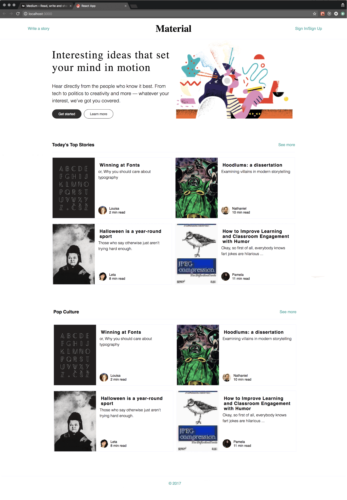
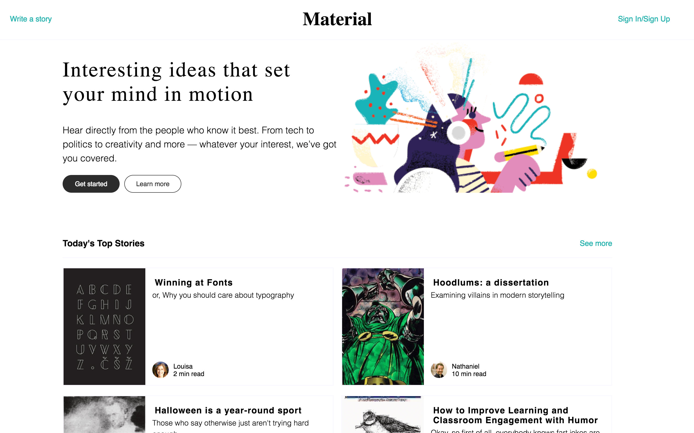

# React Static Comp

### Project Overview
Modify the React Starter Kit repo to recreate the comp below based on the [project spec](https://github.com/turingschool-examples/react-starter-kit/tree/react-static-comp). 

### Images
Original Comp:

My Comp - Desktop View: 

My Comp - Tablet View: 

My Comp - Mobile View: 

### Reflection
This was our first experience using react and it was challenging attempting to navigate a react project without knowing much about how react components are connected. Before this, my projects were fairly seperated between HTML/CSS and Javascript but with React the three feel more integrated with each other with the addition of JSX. 
